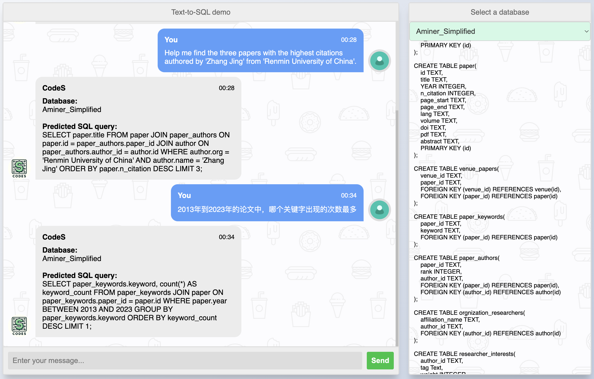

# Text-to-SQL Demo



This repository releases a text-to-SQL demo, powered by [CodeS](https://arxiv.org/abs/2402.16347), a language model specifically tailored for text-to-SQL translation. 

Experience our demo firsthand by visiting: [http://101.42.9.17:5000/chatbot](http://101.42.9.17:5000/chatbot).

**It is important to note that CodeS is designed as a single-turn text-to-SQL model and is not intended for multi-turn conversations.** Consequently, it cannot understand contexts in the chat box. Should the model's responses not meet your expectations, it is advisable to rephrase your question rather than trying to steer the model toward a correct answer with follow-up prompts.

## Environments 💫
Our development environments are configured as follows:
- GPU: NVIDIA A6000 with 40GB VRAM, CUDA version 11.8
- CPU: Intel(R) Xeon(R) Gold 5218R @ 2.10GHz, accompanied by 256GB of RAM
- Operating System: Ubuntu 20.04.2 LTS
- Python Environment: Anaconda3, Python version 3.8.5

### Step 1: Install Java
(If Java is already installed, feel free to skip this step.)

Execute the following commands in your terminal:
```bash
apt-get update
apt-get install -y openjdk-11-jdk
```

### Step 2: Create and Activate a Virtual Anaconda Environment
Run these commands to set up your virtual environment:
```bash
conda create -n demo python=3.8.5
conda activate demo
```

### Step 3: Install Required Python Modules
Ensure you have all necessary packages by running:
```bash
conda install pytorch==1.13.1 torchvision==0.14.1 torchaudio==0.13.1 pytorch-cuda=11.7 -c pytorch -c nvidia
pip install -r requirements.txt
```

Now your environment should be all set up and ready for deployment!

## Prerequisites 🪐
### Step 1: Download Classifier Weights
Download the the file [sic_ckpts.zip](https://drive.google.com/file/d/1V3F4ihTSPbV18g3lrg94VMH-kbWR_-lY/view?usp=sharing) for the schema item classifier. Then, unzip the downloaded file in the root directory of the project:
```
unzip sic_ckpts.zip
```


### Step 2: Set Up Databases
By default, this project includes only one database (i.e., `singer`) in the `databases` folder. 

- To access all databases available in our online demo:
  1. Download and unzip the comprehensive database collection from [databases.zip](https://pan.quark.cn/s/fc6b1ed32fc6). This package contains 248 different databases by merging two manually created databases (Aminer_Simplified and Bank_Financials) with all databases from the [BIRD](https://bird-bench.github.io) and [Spider](https://yale-lily.github.io/spider) benchmarks.

- To add and use your own databases:
  1. Place your SQLite database file in the `databases` directory.
  2. Update the `./data/tables.json` file with the necessary information about your database, including:
     - `db_id`: The name of your database (e.g., `my_db` for a database file located at `databases/my_db/my_db.sqlite`).
     - `table_names_original` and `column_names_original`: The original names of tables and columns in your database.
     - `table_names` and `column_names`: The semantic names (or comments) for the tables and columns in your database.

### Step 3: Build the BM25 Index
To enhance the efficiency of content-based queries on the databases, run the following command to build the BM25 index:
```
python -u build_contents_index.py
```
Please note that this process might take a considerable amount of time, depending on the size and content of the databases. Your patience is appreciated during this step.

Upon completing these steps, your project should be fully configured.

## Launch services 🚀
To initiate the website, execute the following command:
```
python -u app.py
```
This action will start the web application, making it accessible at `http://your_ip:5000/chatbot`. Please note that the user's history questions will be logged and can be accessed in the `data/history/history.sqlite` file.

## Support various languages 🧐
Given that our model is predominantly trained on English text, integrating a translation API becomes essential for handling user's questions in languages other than English. 

In this project, we have utilized Baidu Translate. To facilitate multilingual support, please configure your Baidu Translate API token within the `app.py` script. You can follow these guidelines to create your Baidu Translate application and acquire the necessary API access token: [Baidu Translate API Guide](https://ai.baidu.com/ai-doc/MT/2l317egif) and [Baidu Translate API Reference](https://ai.baidu.com/ai-doc/REFERENCE/Ck3dwjhhu).

It is important to note that the translation quality may influence the model's accuracy. For enhanced text-to-SQL performance in languages of your preference, consider opting for more robust translation engines like Google Translate or DeepL.

## Get in Touch 🤗
For any questions about this project, feel free to open a Github issue or directly contact Haoyang Li via email at lihaoyang.cs@ruc.edu.cn.

## Acknowledgments ✨
Our gratitude extends to the teams behind [ChatBot💬 WebApp in Python using Flask](https://github.com/Spidy20/Flask_NLP_ChatBot), [BIRD](https://bird-bench.github.io), and [Spider](https://yale-lily.github.io/spider) for their outstanding contributions to the field.
